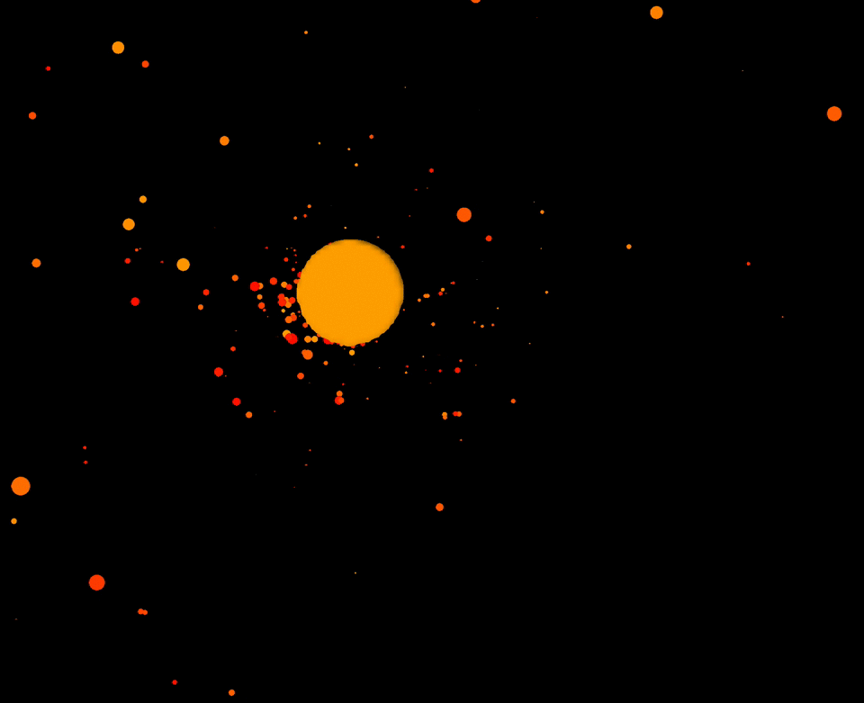

[](https://travis-ci.org/sezna/bigbang)
_Have you used this project in your work? I'd love to hear about it and work with you. Email me at [alex@alex-hansen.com](mailto:alex@alex-hansen.com)._

# About the project
This is a project in re-implementing a C++ particle simulation in Rust for speed comparison purposes. I originally created this tree at Trinity University with Dr. Mark Lewis around 2015. Rust changed a lot in the following years, and so I re-wrote it in 2019. 



_3d websocket-based simulation is available in the examples directory and was provided by [Casey Primozic](https://cprimozic.net/)._

# What exactly does it do?
It constructs a spatial k-dimensional tree (3 dimensions) and optimally calculates gravitational acceleration forces and collisions.

# Getting started with bigbang
## Implementing the `AsEntity` and `Responsive` traits
In order to use your arbitrary type inside this tree, your struct must be `AsEntity + Responsive + Clone + Send + Sync`. I'd like to eventually get rid of the `Clone` requirement, but currently the tree works in an immutable way where each time step an entirely new tree is constructed with the gravitational acceleration applied to it. This makes parallelism easier to reason about and safer, and requires `Clone`. `Send` and `Sync` are required for the parallelism. 

`AsEntity` requires that you represent your struct as a gravitational entity, which entails providing velocity and position vectors, as well as a radius and a mass (all bodies are spheres in this simulation). 

The real meat and potatoes you must implement is the trait `Responsive`. This trait defines how your struct responds to the simulation's results at every time step. 

```rust
impl bigbang::AsEntity for MyStruct {
    fn as_entity(&self) -> bigbang::Entity;
}

impl bigbang::Responsive for MyStruct {
    fn respond(&self, simulation_result: bigbang::SimulationResult, time_step: f64) -> Self;
}
```

`as_entity` must take your struct and return it as a gravitational entity consisting of a velocity vector, a position vector, a radius, and a mass:
```rust
struct MyEntity {
    pub vx: f64,
    pub vy: f64,
    pub vz: f64,
    pub x: f64,
    pub y: f64,
    pub z: f64,
    pub radius: f64,
    pub mass: f64,
}
```

If your struct has these fields and they are named this way already, you can derive the `AsEntity` trait.

```rust
use bigbang::AsEntity;
#[derive(AsEntity)]
struct MyEntity {
    pub vx: f64, // because these fields are named 
    pub vy: f64, // the standard way, the same as in
    pub vz: f64, // the `AsEntity` trait, we can use
    pub x: f64,  // the automatic derive.
    pub y: f64,
    pub z: f64,
    pub radius: f64,
    pub mass: f64,
}
```

`respond(&self, simulation_result: SimulationResult, time_step: f64) -> Self` allows the user to decide how to respond to the simulation results. There are examples of this throughout the `examples` directory, as well as some helper collision calculation functions in the `collisions` module.

## Starting the Simulation
Now that you have a compliant type with sufficient trait implementations, you may construct a vector with the starting positions for all of these entities. Pass a mutable reference to that vector and a _time\_step_ coefficent into `GravTree::new()` and you'll be off to the races:
```rust
use bigbang::{ GravTree, AsEntity };

struct MyEntity { ... }

impl AsEntity for MyEntity { ... }

impl Responsive for MyEntity { ... }

let mut my_vec:Vec<MyEntity> = vec![entity1, entity2, entity3];
let grav_tree = GravTree::new(&my_vec, 0.2);

```

The _time\_step_ coefficient is later passed into `respond()`. It can be used to effectively control the granularity of the simulation, i.e. how much each simulation frame actually impacts the movement of the entities. A smaller _time\_step_ will result in a more granular, more precise simulation. You'll probably have to play around with the constants a little bit to find something ideal for your use case. In order to advance the simulation, call `grav_tree.time_step()`. 

See the examples directory for a minimalist working example.

# C/C++ Interface
There used to be a robust C/C++ interface for this library, but it was difficult to maintain with rapid API changes during development. If you were using this FFI, and would like for it to be re-introduced, please [contact me](mailto:alex@alex-hansen.com) and I will help you set it up. Otherwise, FFI is on hold until this crate stabilizes.